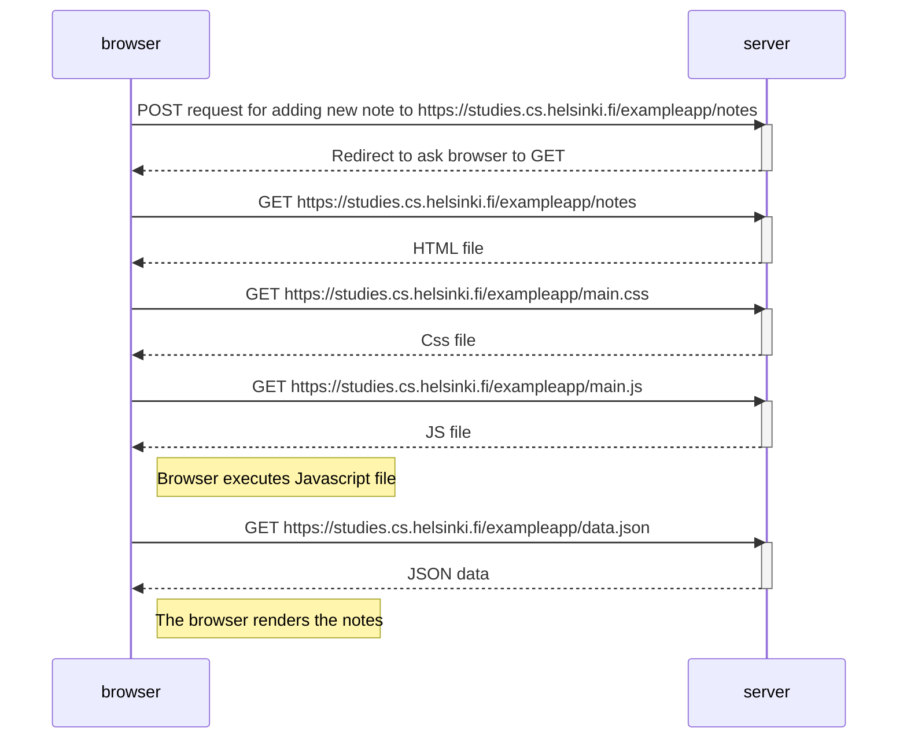

```mermaid
sequenceDiagram
    participant browser
    participant server
    
    browser->>server: POST request for adding new note to https://studies.cs.helsinki.fi/exampleapp/notes
    activate server
    server-->>browser: Redirect to ask browser to GET
    deactivate server
    
    browser->>server: GET https://studies.cs.helsinki.fi/exampleapp/notes
    activate server
    server-->>browser: HTML file
    deactivate server
    
    browser->>server: GET https://studies.cs.helsinki.fi/exampleapp/main.css
    activate server
    server-->>browser: Css file
    deactivate server
    
    browser->>server: GET https://studies.cs.helsinki.fi/exampleapp/main.js
    activate server
    server-->>browser: JS file
    deactivate server

    Note right of browser: Browser executes Javascript file

    browser->>server: GET https://studies.cs.helsinki.fi/exampleapp/data.json
    activate server
    server-->>browser: JSON data
    deactivate server

    Note right of browser: The browser renders the notes
```
